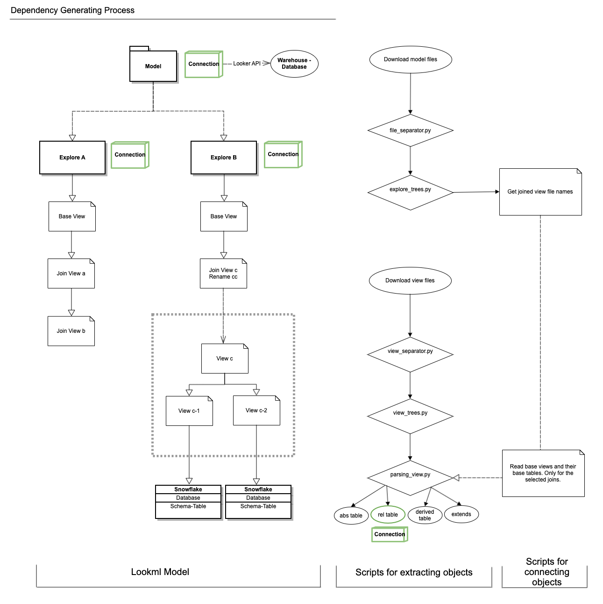
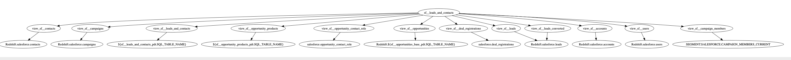

This is repo contains scripts to manipulate LookML files, and to generate dependency graphs for each explore.

# Current worlflow:

1. Script `parser.py` contains many file actions, including splitting up views into view files containing single views, splitting up explore files into single explores, getting joined views from explore statements.

2. Script `parsing_model.py` contains these steps:

    *1)* Split up Model files to Explore paylods
    
    *2)* Parse explores and retrieving explore metadata.

    *3)* Split up View files to base views.
    
    *4)* Parse base views and retrieving view metadata.

3. Script `sourcing_explore.py` generates "maps" for each view that is referenced within each explore (with specific connection that contains details about the data warehouse and schemas). 

4. Script `graphing_explore.py` generates graphs for each explore, with nodes representing view names and base table names.

* Tests are stored in `test_folder`, with sample models, explores and view files for testing `src` scripts.

# Diagram as of 2019-10-15:

# Sample dependency chart:

# Ideal goals:

The deliverable will be a static webpage (something like `dbt` does for model lineage visualization), which parses Lookml files from an S3 bucket. The S3 bucket is being updated on a set schedule (hourly/daily), to reflect the near real-time business logics within the Looker ecosystem. 

A tree-shaped diagram indicates all depencencies from the main node (parent node). The data source will be traced back to either a `pdt` table or a raw event table from the databases in Snowflake.

There are two parts of Lookml lineage:

1. Front-end: 
Dashboards, Looks, Explores (renamed by `view_label`), Explore Label groups. Content Validator is the test tool.

2. Back-end:
Models with multiples explores (with original explore name), view names (reference view file names), and folder names. 

On the Snowflake side, all lineages are considered as "Back-end". The destination event tables will be quoted as their real table paths within databases, except for the "persistent derived table (pdt)" that are generated by Looker. In this case, we will extract the human readable pdt name with the `_pdt` suffix, avoiding random strings that are generated at each runtime.

One question to tackle when we move on to Phase two, is that: 

>  How do we stitch together the front-end and back-end lineage for an end-to-end monitoring and tracking process?

# The even bigger picture of this project consists at least the following parts:

1. An end-to-end near real-time tracker system for all data lineage from the raw event sources in the BI databases (Snowflake).

2. Embed a unit testing system based on the main (most popular) queries to GitHub PR, together with content validator.

3. Alerting system for any *yellow light* or *red light* data paths that are experiencing latency, performance issue, or failure at query time.

4. Cost analysis, cost of query per explore, tie back to the team usage of Looker.
